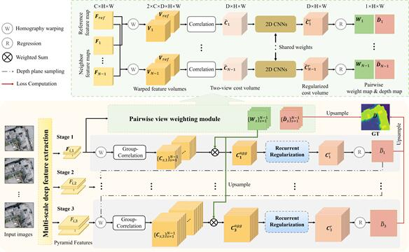

# Ada-MVS
The code of Ada-MVS for "Deep learning based multi-view stereo matching and 3D scene reconstruction from oblique aerial images (ISPRS) "

paper link:[ISPRS_2023](https://www.sciencedirect.com/science/article/pii/S0924271623002289)


This code is an implementation of Ada-MVS (adaptive multi-view aggregation matching network), which aims to infer the reference depth map from a set of oblique aerial multi-view images with known imaging parameters.




## Requirements
* python 3.7
* pytorch >= 1.3.1
* opencv-python >= 4.1
* numpy >= 1.19

## Data Preparation
1. Download the WHU Oblique MVS dataset.  http://gpcv.whu.edu.cn/data. <br/>
2. Unzip the dataset to the ```WHU_OMVS``` folder. <br/>
```
WHU_OMVS
├── train    
├── test
├── predict                                
             
```

## Training

1. In ```train_whu.py```, set ```mode``` to ```train```, set ```model``` to ```adamvs```, set ```set_name``` to ```whu_omvs```<br/>
2. Set ```trainpath``` to your training data folder ``` YOUR_PATH/WHU_OMVS/train```, and set ```testpath``` to your validation data folder ``` YOUR_PATH/WHU_OMVS/test```<br/>
3. Set ```loadckpt``` to ```None```<br/>
2. Train the model:<br/>
```
python train_whu.py
```

## Testing
1. In ```train_whu.py```, set ```mode``` to ```test```, set ```model``` to ```adamvs```, set ```set_name``` to ```whu_omvs```<br/>
2. set ```testpath``` to your test data folder ``` YOUR_PATH/WHU_OMVS/test```<br/>
3. set ```loadckpt``` as your checkpoint file <br/>
2. Test the model:<br/>

```
python train_whu.py 
```

The test outputs are stored in ```YOUR_PATH/WHU_OMVS/test/depths_whu_omvs/```, including depth map ```XXX_init.pfm```, probability map ```XXX_prob.pfm``` and the visual results in  ```color``` folder.<br/>


## Predict
1. In ```predict_whu.py```, set ```model``` to ```adamvs```. <br/>
2. set ```data_folder``` to the test data information folder ``` YOUR_PATH/WHU_OMVS/predict/source```, set ```output_folder``` to your save path ``` OUTPUT_PATH```<br/>
3. set ```loadckpt``` as your checkpoint file <br/>
2. Run inference:<br/>

```
python predict_whu.py 
```

The inferred results are stored in ```OUTPUT_PATH```, including depth map ```XXX_init.pfm```, probability map ```XXX_prob.pfm``` and the visual results in  ```color``` folder.<br/>


## Cite
If you find this code useful in your research, please cite:

```
@article{liu_deep_2023,
	author = {Liu, Jin and Gao, Jian and Ji, Shunping and Zeng, Chang and Zhang, Shaoyi and Gong, JianYa},
	title = {Deep learning based multi-view stereo matching and {3D} scene reconstruction from oblique aerial images},
	volume = {204},
	issn = {09242716},
	journal = {ISPRS Journal of Photogrammetry and Remote Sensing},
	month = oct,
	year = {2023},
	pages = {42--60},
}
```
and 
```
@inproceedings{liu_novel_2020,
   author = {Liu, Jin and Ji, Shunping},
	title = {A Novel Recurrent Encoder-Decoder Structure for Large-Scale Multi-View Stereo Reconstruction From an Open Aerial Dataset},
	booktitle = {2020 {IEEE}/{CVF} Conference on Computer Vision and Pattern Recognition ({CVPR})},
	month = {June},
	year = {2020},
	pages = {6049--6058}
	}
```


## Reference
This project takes the [CasMVSNet](https://github.com/alibaba/cascade-stereo) and [REDNet](https://github.com/gpcv-liujin/REDNet-pytorch) as its backbone, and we thank the authors for providing the source code.
